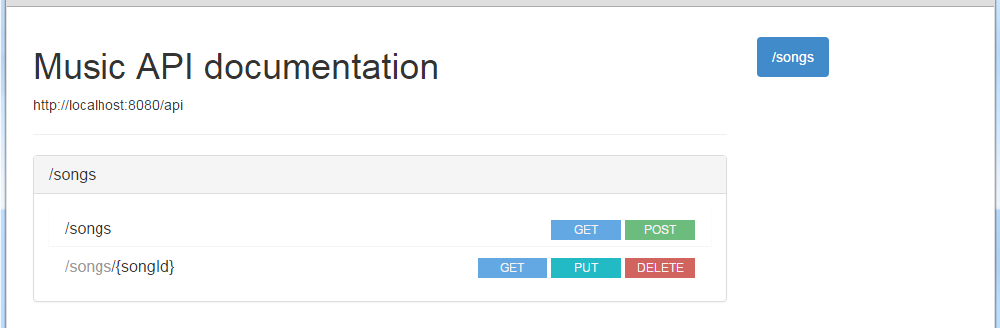
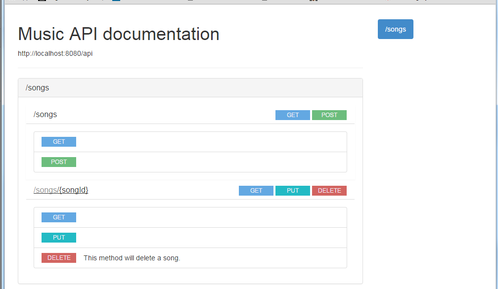
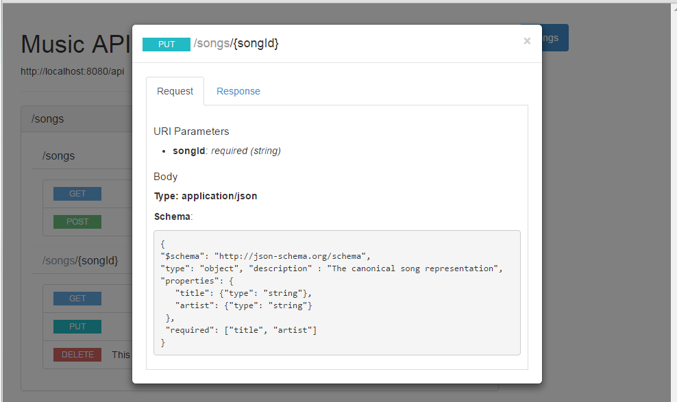

# Contract First Api Design with RAML

Distributed team with multiple people working on different part of the project. Co-ordinating and being on the same page is difficult. But if there is an aggrement about the API beforehand, integration can go in parallel and does not have to come at last. Agreement also helps UI (Design team) to work independent with the API team and does not have to worry about the server being constantly restarted and redeployed. We will use RAML to design the API and use pre-existing RAML tool to generate the html pages that makes it easy to understand the APIs and RAML mock services. Mock services helps to test the API during the initial phase of development.

__RAML__ - RESTful API Modeling Language ([RAML](http://raml.org/)) is a simple and succinct way of describing practically-RESTful APIs. It encourages reuse, enables discovery and pattern-sharing, and aims for merit-based emergence of best practices.

I have designed a small API to show the benefits and advantage of RAML. The API is a toy example.

## Generating readable service description document.
``
npm install -g raml2html
``

Once [raml2html](https://www.npmjs.com/package/raml2html) is installed you can generate the HTML as shown below:
``
raml2html music.raml > music.html
``

This produces the HTML file that is easy to understand. I have attached some screen-shots here.

### Initial Screen showing all the APIS in music.raml

### Page with all operations in all resources defined in music.raml

### Page with update operation for a song resource in music.raml

## Running the mock service

``npm install -g osprey-mock-service
``

Start the [osprey-mock-service](https://www.npmjs.com/package/osprey-mock-service) from the CLI.  This will automatically use the baseUri as the path to the mock service. For example, http://example.com/api will result in http://localhost:{PORT}/api.

``osprey-mock-service -f music.raml -p 8000
``

The parameters in the above command are
* -f Path to the root RAML definition (E.g. /path/to/api.raml)
* -p Port number to bind the server locally

Once you have stated the mock service you can make the request from the browser or other HTTP clients.
